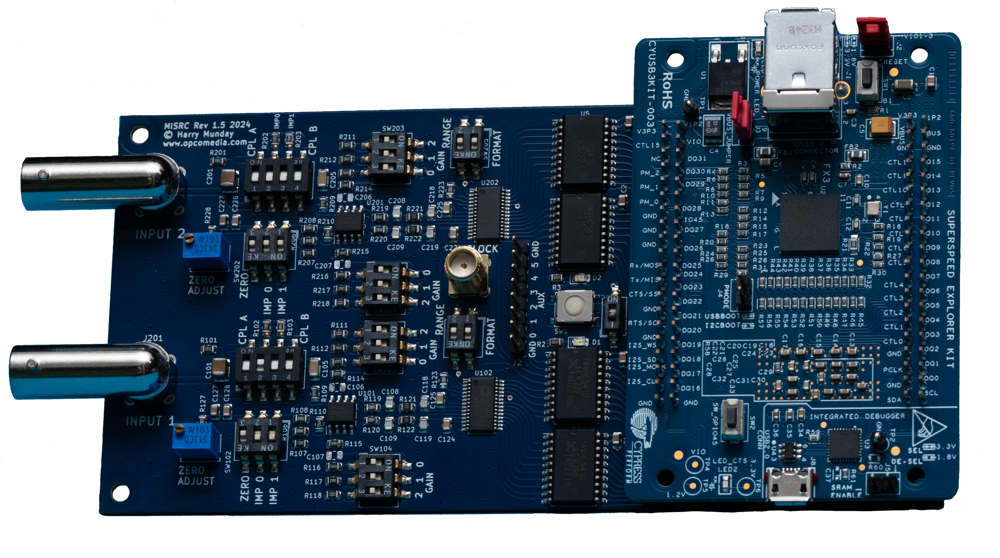

# MISRC - Multi Input Simultaneous Raw RF Capture

<picture>
  <source srcset="https://stefan-olt.github.io/MISRC/assets/hardware-images/MISRC_v1.5_Sony_ILCE-7RM3_2024.06.07_14.30.14.jxl" type="image/jxl" width="600" />
  <source srcset="https://stefan-olt.github.io/MISRC/assets/hardware-images/MISRC_v1.5_Sony_ILCE-7RM3_2024.06.07_14.30.14.png" type="image/png" width="600" />
  
</picture>

## Description


MISRC is a device to capture two signals at 12-bit and up to 40 MHz (could maybe be extended to 80 MHz in the future) and an additional 8-bit's of binary (auxiliary data) over USB 3.0.

It is intended to capture modulated tape deck RF for software demodulation, but also baseband CVBS/S-Video (Composite) video signals for software decoding, and can be used as a direct stream Oscilloscope but limited to 2vpp input voltage.

The decode projects:

- [VHS-Decode](https://github.com/oyvindln/vhs-decode/)
- [HiFi-Decode](https://github.com/oyvindln/vhs-decode/wiki/hifi-decode)
- [CVBS-Decode](https://github.com/oyvindln/vhs-decode/wiki/CVBS-Composite-Decode) 

Provide decoding for a wide range of videotape formats, HiFi audio and even RAW or Baseband composite decoding with free and powerful software time base correction with full post filtering control over the signal processing.

-----------

Possible capture examples:

- Capture 2x CVBS
- Capture 1x S-Video (Y & C)
- Capture Video RF and HiFi RF simultaneously
- Capture Video RF and CVBS simultaneously
- Capture 4ch of 24-bit 48khz audio with AUX pins via integrated or external ADCs

> [!NOTE]
> It may be useful for other purposes as well, as it is built as a generic ADC with configurable filtering.


## Features


- Two 12-bit 40msps ADCs 
- Selectable input gain (8 steps)
- Selectable ADC range (1V or 2V)
- Selectable input impedance (75, 50, 37.5 and 30 ohms)
- DC or AC (pre- or post-termination) coupling
- Zero-adjust to compensate DC offset
- Latching clipping indicator
- Clock source selectable: USB PLL, crystal or external
  Clock output SMA for external devices
- Melted PCB Traces


## Costs


- PCB: 20-30USD

- Parts 100-150USD


## Hardware 


- External Clock Source Output
- 6 Extra Aux inputs for audio ADC modules etc
- Duel ADC / Duel Input (BNC Connectors)
- Physically adjustable input filters
- 12-Bit, 20/40/65msps sampling
- [AD8138](https://www.analog.com/media/en/technical-documentation/data-sheets/ad8138.pdf) Driver, Op-Amp / [SN74ls541](https://www.ti.com/lit/ds/symlink/sn74ls540.pdf) Buffer / [AD9235](https://www.analog.com/media/en/technical-documentation/data-sheets/AD9235.pdf) ADC

-----

- [Tang Nano 20k](https://s.click.aliexpress.com/e/_DcwBOX3) - buffer / data output over HDMI
- [MS2130](https://s.click.aliexpress.com/e/_DBaBiOp) - HDMI data stream capture


## Software Setup 


There are 2 tools currently and a few dependencies required to deploy a MISRC.

- MISRC Capture
- MISRC Extract

<details closed>

<summary>Software Install Guide</summary>
<br>

Depedencys 

- `apt install libflac-dev`

Install [hsdaoh](https://github.com/Stefan-Olt/hsdaoh) this allows you to use the MS2130 & MS2131 chips directly. 

Restart and then continue

Install capture & extract tools (Linux & MacOS)

    git clone https://github.com/Stefan-Olt/MISRC.git

Enter Directory

    cd MISRC/misrc_tools

Build and install 

```
mkdir build
cd build
cmake ..
make
sudo make install
```

Run `mirsc_extract` or `misrc_capture` in any directory without arguments to trigger the help menu.

There is a dedicated [sub-readme](/misrc_tools/README.md) for these tools.


</details>


# Firmware Flashing 


Originally the MISRC was based around the FX3 interface for a USB 3.0 connection, and using Sigronk for capture, this did not work perfectly.

So today we are now using the more affordable [Tang Nano 20k](https://s.click.aliexpress.com/e/_DcwBOX3) sending the data over HDMI this only needs to be flashed once via usb connection and we have pre-compiled firmware see [releases](https://github.com/Stefan-Olt/MISRC/releases) for the latest version.

Install [openFPGALoader](https://github.com/trabucayre/openFPGALoader)

Connect your Tang to a USB 3.0 port via its Type-C, it will need this for 5V power after flashing, but not data.

Run via terminal inside the firmware directory

    openFPGALoader -b tangnano20k -f hsdaoh_nano20k_misrc.fs

You have flashed your Tang Nano 20k! 


## Capture


> [!CAUTION]
> NEVER use USB for any other heavy-load task (like external HDD/SSD drives, USB network adapters, YUV capture devices) during capture. Do not connect/disconnect any other USB device during capture, a dedicated USB 3.0 to 3.2 Gen 2 card is ideal for dedicated capture stations as it ensures dedicated bandwidth/power if you have other items that require USB.


- Connect the desired sources to the BNC inputs and select suitable impedance and coupling

- Start the capturing process for setting the gain:
    - Reset clipping LEDs (always on after start)
    - Increase gain during capture until clipping LED lights up
    - Decrease gain one step and reset clipping LED
    - Repeat for the second channel if in use

- Stop capture and verify levels are acceptable in an audio editor (Audacity/Audition etc)

- Start capture.

- Stop capture.

---------

`misrc_capture` is a simple program to capture from MISRC using [hsdaoh](https://github.com/Stefan-Olt/hsdaoh) to which levrages data capture over HDMI with [MS2130](https://s.click.aliexpress.com/e/_DBaBiOp) "U3" cheep HDMI capture cards that have YUV support. 

Create a folder which you wish to capture inside, open it inside terminal and then run `misrc_capture`

Example RAW:

    misrc_capture -a video_rf.s16 -b hifi_rf.s16

Example with FLAC compression:
    
    misrc_capture -f -a video_rf.flac -b hifi_rf.flac 

You can also define its directory path of each RF stream manually: 

    misrc_capture -f -a /mnt/my_video_storrage/video_rf.flac -b ../../this/is/a/relative/path/hifi_rf.flac

<details closed>

<summary>Usage Arguments:</summary>
<br>


`-d` device_index (default: 0)

`-n` number of samples to read (default: 0, infinite)

`-a` ADC A output file (use '-' to write on stdout)

`-b` ADC B output file (use '-' to write on stdout)

`-x` AUX output file (use '-' to write on stdout)

`-r` raw data output file (use '-' to write on stdout)

`-p` pad lower 4 bits of 16 bit output with 0 instead of upper 4

`-f` compress ADC output as FLAC
	
`-l` LEVEL set flac compression level (default: 1)

`-v` enable verification of flac encoder output

</details>


## Design


MISRC is loosely based on the [Domesday Duplicator (DdD)](https://github.com/simoninns/DomesdayDuplicator). 

Like the DdD it originally used the Cypress FX3 SuperSpeed Explorer board, with hopes to not use the DE0 FPGA. 

It is built around the AD9235 analogue to digital converter by Analog Devices and is heavily based on the evaluation board circuit given in its datasheet with the AD8138 Op-Amp providing adjustable fixed gain.


## License


You can read the [License here](https://github.com/Stefan-Olt/MISRC/wiki/Licence).
